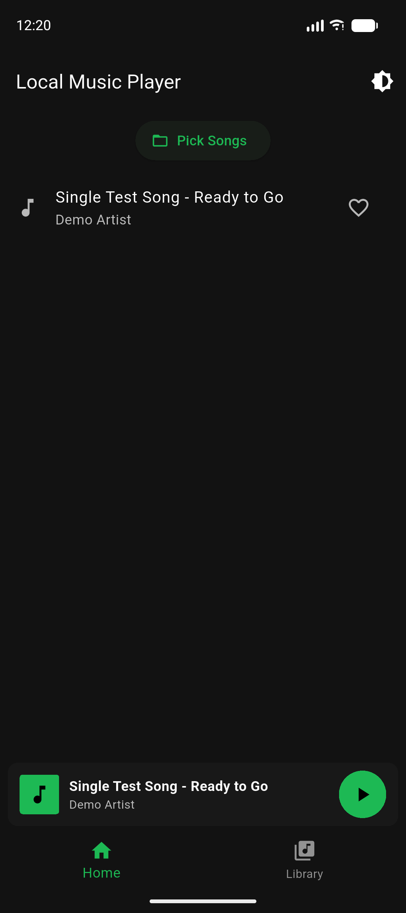
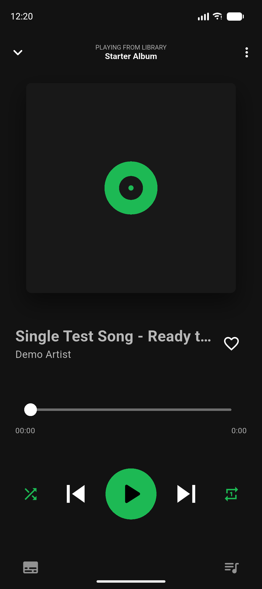
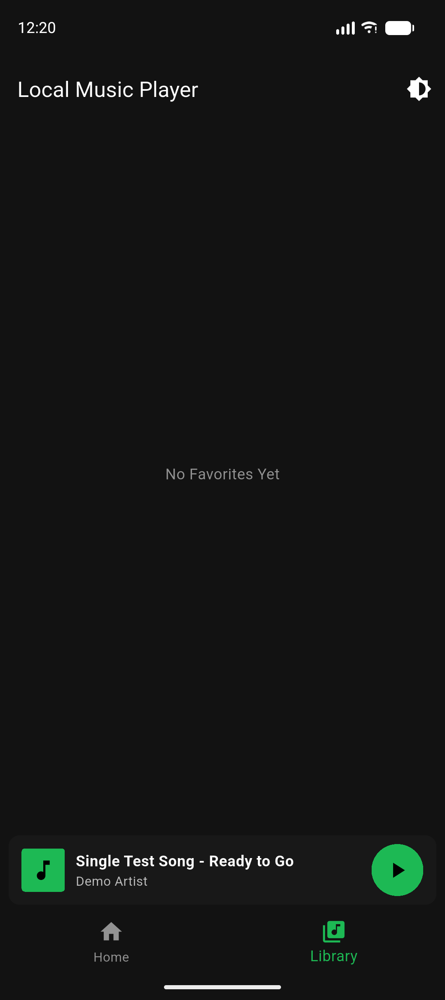
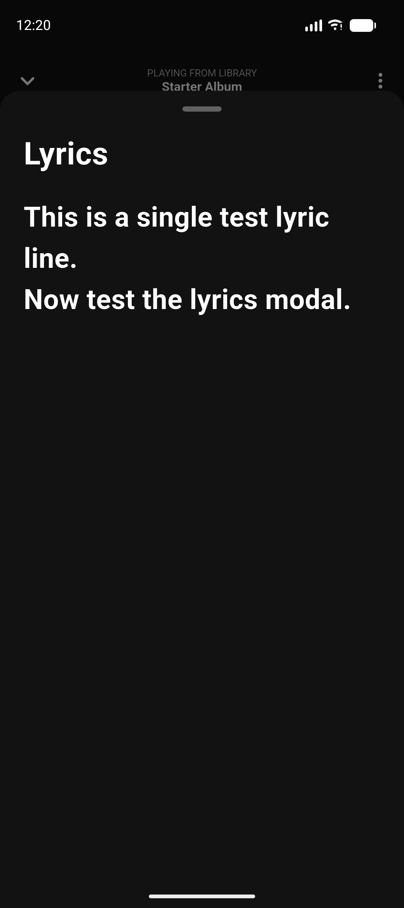

# 🎶 Local Music Player (Flutter)

A sleek, local-file-based music player application built with Flutter, designed to mimic the **Spotify Dark Theme** aesthetic. This app provides essential features like local file browsing, state management via Provider, background audio playback using `just_audio`, and persistent storage for user favorites.

---

## ✨ Features

* **Spotify Dark Theme:** A clean, visually appealing dark-mode interface with the signature green accent color.
* **Local File Picker:** Easily import audio files (MP3, etc.) from your device using `file_picker`.
* **Metadata Retrieval:** Automatically extracts song titles, artists, albums, and **lyrics** using `flutter_media_metadata`.
* **Persistent Favorites:** Uses `shared_preferences` to save and manage a list of your favorite songs across sessions.
* **Full-Featured Player:**
    * **Background Playback:** Audio continues even when the app is in the background.
    * **Progress Bar:** Functional slider for seeking to any position in the song.
    * **Playback Controls:** Play/Pause, Next, Previous, Shuffle, and Repeat modes.
* **Lyrics View:** Dedicated modal for viewing track lyrics when available.

---

## 📸 Demos and Screenshots

| Home Screen | Full Player Screen | Favorites Library | Lyrics Modal |
| :---: | :---: | :---: | :---: |
|  |  |  |  |

---

## 🚀 Getting Started

### Prerequisites

* **Flutter SDK:** Make sure you have Flutter installed and configured.
* **Android/iOS Device or Emulator:** The app requires media file access.
* **Permissions (Android):** Ensure the necessary file read permissions are set in your `android/app/src/main/AndroidManifest.xml`:

    ```xml
    <uses-permission android:name="android.permission.READ_EXTERNAL_STORAGE"/>
    <uses-permission android:name="android.permission.INTERNET"/>
    ```

### Installation

1.  **Clone the Repository:**
    ```bash
    git clone [https://github.com/yourusername/local-music-player.git](https://github.com/yourusername/local-music-player.git)
    cd local-music-player
    ```

2.  **Install Dependencies:**
    ```bash
    flutter pub get
    ```

3.  **Run the App:**
    ```bash
    flutter run
    ```

---

## 📂 Project Structure & Key Files

The application's state and architecture are managed using the **Provider** package.

| File | Description | Key Components |
| :--- | :--- | :--- |
| `main.dart` | Application entry, theme setup, and provider initialization. | `MultiProvider` setup. |
| `models/songs.dart` | The **Song data model**, including the nullable `lyrics` field. | `Song` class. |
| `providers/player_provider.dart` | Manages audio playback, streams (position, duration), and basic controls. | `AudioPlayer` (`just_audio`), `seek()`, `nextSong()`. |
| `providers/library_provider.dart` | Manages persistent storage for favorites. | `SharedPreferences`, `toggleFavorite()`. |
| `pages/home_page.dart` | Main screen for listing songs and accessing the file picker. | `FilePicker`, `MetadataRetriever`. |
| `pages/player_page.dart` | Full-screen player view with the progress bar and controls. | `StreamBuilder` (for position/duration streams). |
| `widgets/mini_player.dart` | The persistent player control at the bottom of the home screen. | `GestureDetector`, `Consumer`. |

---

## 💡 How to Use

1.  **Pick Songs:** On the **Home** tab, tap the **"Pick Songs"** button.
2.  **Playback:** Tap any song to begin playing and navigate to the full-screen player.
3.  **Seeking:** On the full player, drag the slider to quickly jump to any point in the track.
4.  **Favorites:** Use the heart icon to add/remove a song from your **Library**.
5.  **Lyrics:** Tap the subtitle icon (📰) on the player page to view embedded lyrics.
